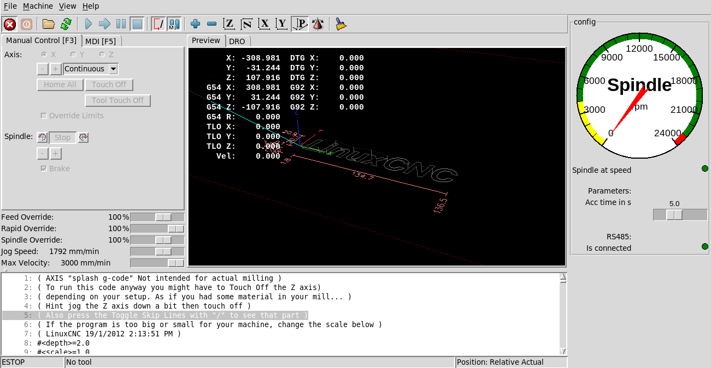
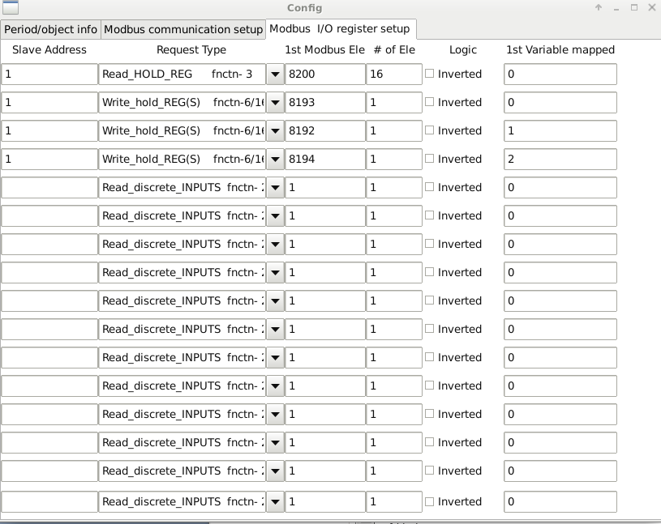
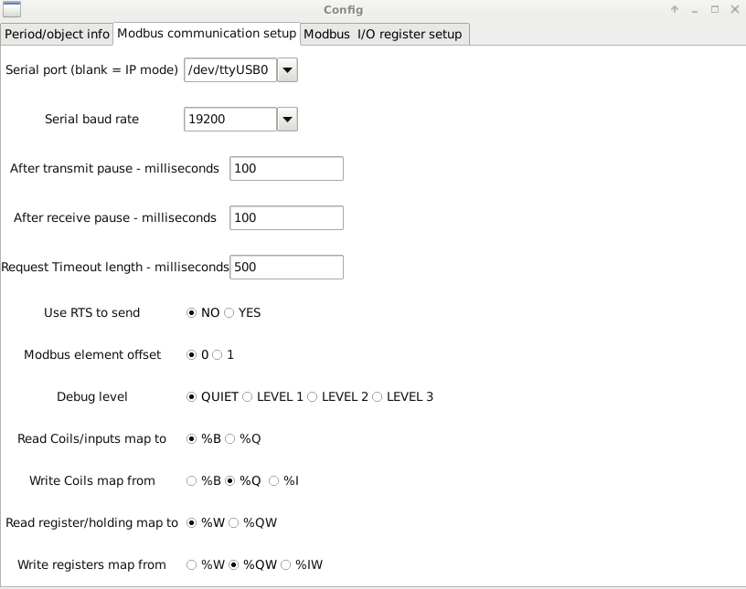

# LinuxCNC-Yalang-yl620-VFD-rs485-Modbus-ClassicLadder
SUPPORT ME: Follow this link and I earn a commisson when you buy something on Amazon. https://amzn.to/3UL9x0i. 

### About

This repository should help users to integrate the YL620 VFD using Modbus RS485 into LinuxCNC. This integration is based on ClassicLadder. In my other [repository](https://github.com/xsnoopy/LinuxCNC-Yalang-yl620-VFD-rs485-Modbus---VFDmod) I am using VFDmod, but I would suggest stay as much as you can with standard components of LinuxCNC. I believe as well that with ClassicLadder you should be able to use other Modbus devices at the same time. It seems to be possible, to use the X1-X8 Terminals of the VFD as field Inputs. But since I don’t have a use for that, I haven’t bothered with it. Leave a pull request and I might integrate that as well. For questions it's best to use the LinuxCNC forum https://forum.linuxcnc.org/47-hal-examples/44328-yalang-yl620-vfd-rs485-modbus-communication-vfdmod-or-classicladder

The VFD RS 485 Signal is very noisy. I used this adapter which works best for me 
https://amzn.to/4886Km0 (Amazon affiliate link)

### How to

- Set up the VFD drive to receive signals via Modbus. 
  - P00.01 = 3  Start/Stop command source RS485
  - P03.00 = 4  for 19200Bps
  - P03.01 = 1  RS485 slave address 1
  - P03.02 =  2  Data transfer format 8 bit data, 1 stop bit, no parity
  - P07.08 =  5  Frequency source selection RS 485
- Connect the VFD with your USB Rs485 adapter.
- Download vdf.hal vfd.clp and vfd.xml to your linuxcnc/config/NAME folder. Replace NAME with the name of your machine. 
- Add this to your machine hal file at the end

`loadrt classicladder_rt numS32out=100`

`addf classicladder.0.refresh servo-thread`

`loadusr classicladder --modmaster vfd.clp`

`net spindle-on          classicladder.0.in-00   spindle.0.on`

`net spindle-brake       classicladder.0.in-01   spindle.0.brake`

`net spindle-forward     classicladder.0.in-02   spindle.0.forward`

`net spindle-reverse     classicladder.0.in-03   spindle.0.reverse`

`net spindle-cmd-rpm     <= spindle.0.speed-out`

`net spindle-cmd-rpm-abs <= spindle.0.speed-out-abs`

`net spindle-cmd-rps     <= spindle.0.speed-out-rps`

`net spindle-cmd-rps-abs <= spindle.0.speed-out-rps-abs classicladder.0.floatin-00`

- Add this to your machine postgui_call_list.hal file at the end

`source vfd.hal`
 
 - Set up classic ladder 
 
  
 
 

# Changelog
- `02. December 2023` Corrected some errors in the Readme file. 
